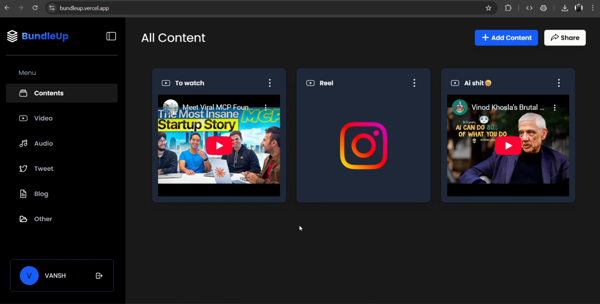

# 📦 BundleUp

[**BundleUp**](https://bundleup.vercel.app) lets you save, organize, and share all your favorite videos, tweets, blogs, and more in one place.

## 🪟 Screenshot
</img>

## ⚙️ Tech Stack

- Frontend: React, TypeScript, TailwindCSS, Framer Motion
- Backend: Node.js, Express
- Deployment: Vercel (Frontend), Render (Backend)

## 🚀 Features

- Add content (title + link)
- Categorize by type (Video, Tweet, Blog, Audio, Other)
- Share your bundle via link
- Clean, responsive UI

## 🛠 Setup

```bash
# Frontend
cd client
npm install
npm run dev

# Backend
cd server
npm install
npm run start
